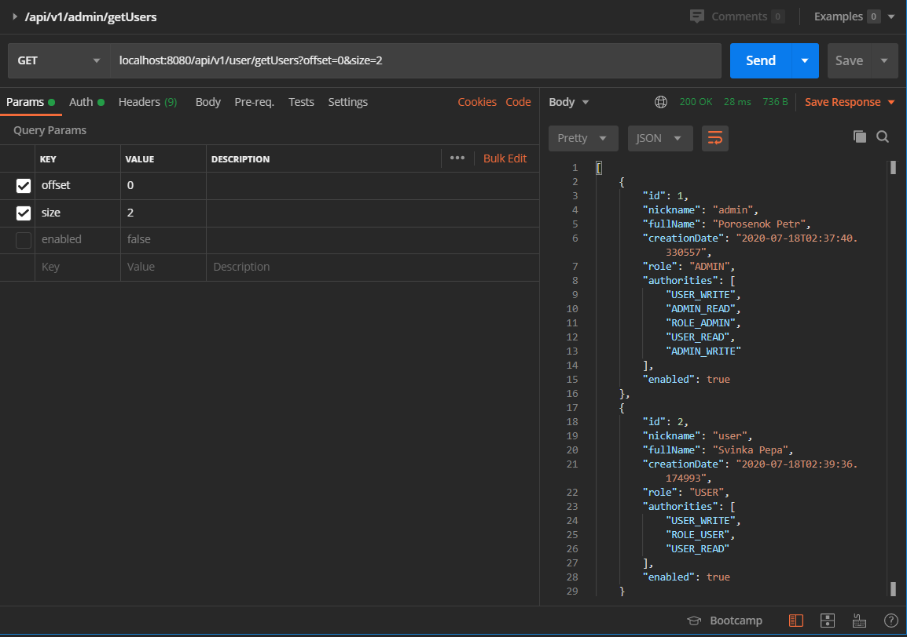
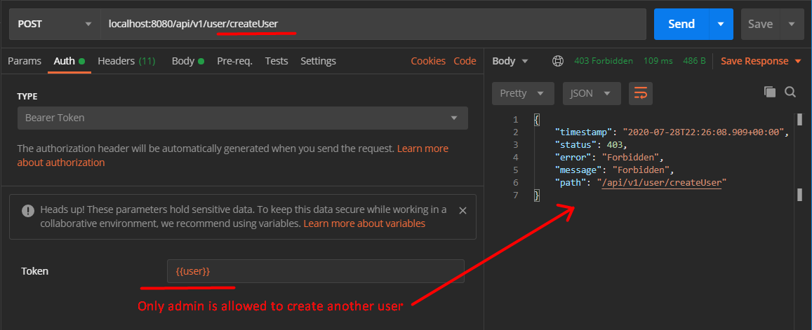
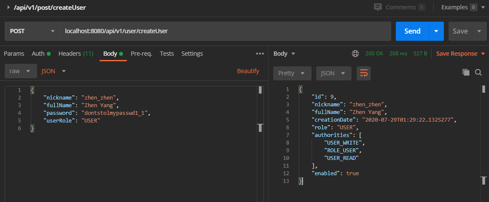

# Java Ape
Java Restful API on top of the Spring stack.

### Used technologies:
* Java 11
* Spring Boot
  * Spring Data JPA
  * Spring Security
  * Spring Web
* JWT
* Hibernate
* MySQL
* VAVR
* Lombok

### Description
The idea of application is simple: we have users, users have posts.
Users can have different roles(ADMIN, USER) and 
permissions(USER_WRITE, ADMIN_READ, etc.).
Based on roles and permissions we can control 
access to the API endpoints.
The app implements JWT authentication and CRUD operations.

Application can be configured locally using `application.properties` or 
using env variables(`DB_URL`, `JWT_SECRET`, etc.) to run it on remote host.

By default, a default admin will be created on startup.
You can control this behavior using `default.admin.*` properties 
or `DEF_ADMIN_*` env variables.

### Screenshots

